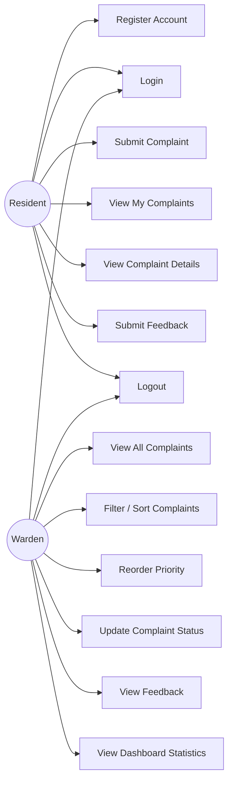

# Use Cases and User Stories
## Dormfix — Hostel Complaint & Maintenance Management System

**Group Number:** [Group Number]

---

## 1. Actors

| Actor | Description |
|-------|-------------|
| Resident | A hostel student who reports and tracks maintenance issues |
| Warden | The staff member who reviews, prioritizes, and resolves complaints |

## 2. Use-Case Diagram (Mermaid)

Paste the block below into any Mermaid-compatible viewer (e.g.
mermaid.live, the Mermaid VS Code extension, or directly into a
Markdown file that supports Mermaid) to render the diagram. Export it
as a PNG/PDF for the report if a static image is required.

## 3. Use-Case Descriptions

### UC-01: Register Account
- **Actor:** Resident
- **Precondition:** User does not already have an account
- **Main Flow:**
  1. Resident opens the registration page
  2. Enters full name, registration number, room number, email, password
  3. System validates all fields and uniqueness of email/registration number
  4. System creates the account with role "resident" and logs the user in
- **Alternate Flow:** If email or registration number already exists, system shows an error and does not create the account
- **Postcondition:** Resident account exists and is authenticated

### UC-02: Login
- **Actor:** Resident, Warden
- **Precondition:** User has a valid account
- **Main Flow:**
  1. User enters email and password
  2. System verifies credentials
  3. System issues a JWT and redirects to the appropriate dashboard based on role
- **Alternate Flow:** Invalid credentials → system shows a generic "invalid email or password" error (no hint as to which field is wrong)

### UC-03: Submit Complaint
- **Actor:** Resident
- **Precondition:** Resident is logged in
- **Main Flow:**
  1. Resident opens "Create Complaint"
  2. Enters a description and optionally attaches an image
  3. System auto-fills name, room number, and registration number from the resident's profile
  4. System generates a unique complaint ID and sets status to SUBMITTED
- **Alternate Flow:** Description too short → validation error shown; invalid image type/size → upload rejected

### UC-04: View My Complaints
- **Actor:** Resident
- **Main Flow:** Resident opens the dashboard and sees a list/history of only their own complaints with current status and overdue indicator

### UC-05: View Complaint Details
- **Actor:** Resident, Warden
- **Main Flow:** User opens a specific complaint and sees full details (description, image, timestamps, status)
- **Alternate Flow (Resident):** Attempting to open another resident's complaint ID directly is rejected with a 403 Forbidden response

### UC-06: Submit Feedback
- **Actor:** Resident
- **Precondition:** Complaint status is RESOLVED and no feedback has been submitted yet
- **Main Flow:** Resident rates the resolution (1–5) and optionally adds a comment
- **Alternate Flow:** Feedback attempted before resolution, or a second time on the same complaint → rejected

### UC-07: Logout
- **Actor:** Resident, Warden
- **Main Flow:** User clicks logout; token is cleared locally and user is redirected to login

### UC-08: View All Complaints
- **Actor:** Warden
- **Main Flow:** Warden opens their dashboard and sees every complaint from every resident, newest first by default

### UC-09: Filter / Sort Complaints
- **Actor:** Warden
- **Main Flow:** Warden applies filters (status, overdue, room) and/or changes the sort order; the list updates accordingly

### UC-10: Reorder Priority
- **Actor:** Warden
- **Main Flow:** Warden manually moves a complaint up or down in the priority list; the system persists the new order
- **Note:** This is a manual decision only — the system does not calculate or suggest priority automatically

### UC-11: Update Complaint Status
- **Actor:** Warden
- **Main Flow:** Warden changes a complaint's status following the allowed transitions (SUBMITTED → UNDER_PROGRESS → RESOLVED, or SUBMITTED → RESOLVED directly)
- **Alternate Flow:** An invalid transition (e.g. RESOLVED → SUBMITTED) is rejected by the server regardless of what the frontend sends

### UC-12: View Feedback
- **Actor:** Warden
- **Main Flow:** Warden opens a resolved complaint and sees the resident's rating and comment, if submitted

### UC-13: View Dashboard Statistics
- **Actor:** Warden
- **Main Flow:** Warden sees aggregated counts (total, by status, overdue) and a simple resolved-per-day chart

---

## 4. User Stories with Acceptance Criteria

*(Alternative/complementary format to the use cases above — useful if
your course prefers Agile-style documentation.)*

**US-01:** As a resident, I want to register with my hostel details so
that I can start submitting complaints.
- **Acceptance Criteria:**
  - Given valid unique details, the account is created and I am logged in
  - Given a duplicate email or registration number, I see a clear error and no account is created

**US-02:** As a resident, I want to submit a complaint with a
description and photo so that the warden understands the issue
clearly.
- **Acceptance Criteria:**
  - Given a description of at least 5 characters, the complaint is created with status SUBMITTED
  - Given an image over 5MB or an unsupported format, the upload is rejected with a clear message

**US-03:** As a resident, I want to see only my own complaints so
that my information stays private from other residents.
- **Acceptance Criteria:**
  - My dashboard never shows another resident's complaint
  - Directly requesting another resident's complaint by ID returns a 403 error

**US-04:** As a resident, I want to rate how my complaint was resolved
so that I can give feedback on the maintenance process.
- **Acceptance Criteria:**
  - Feedback form only appears after status is RESOLVED
  - I cannot submit feedback twice on the same complaint

**US-05:** As a warden, I want to see all complaints in one place so
that I don't rely on informal reporting channels.
- **Acceptance Criteria:**
  - All complaints from all residents appear, newest first by default
  - I can filter by status, overdue flag, and room number

**US-06:** As a warden, I want to manually reorder complaints so that
I can prioritize based on my own judgment, not an automated score.
- **Acceptance Criteria:**
  - I can move any complaint up or down
  - The system never reorders complaints on its own

**US-07:** As a warden, I want the system to flag complaints overdue
by more than 48 hours so that nothing gets forgotten.
- **Acceptance Criteria:**
  - The overdue flag is calculated from the server clock, not trusted from the browser
  - A resolved complaint is never shown as overdue
