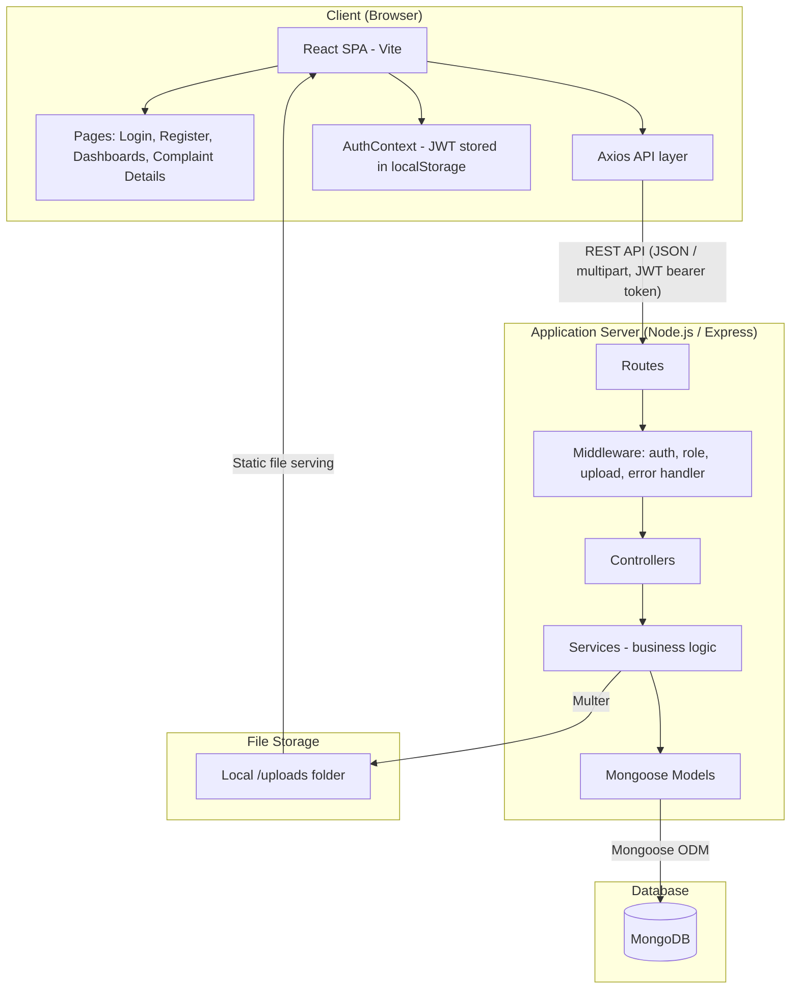
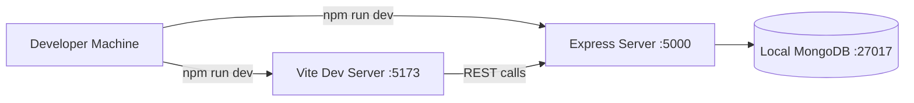

# System Architecture
## Dormfix — Hostel Complaint & Maintenance Management System

**Group Number:** [Group Number]

---

## 1. High-Level Architecture Diagram

Paste into a Mermaid renderer (mermaid.live or similar) and export as
PNG/PDF for the report appendix if a static image is preferred.

## 2. Architectural Style

Dormfix follows a classic **three-tier client-server architecture**:

1. **Presentation Tier** — React single-page application responsible
   only for rendering UI and calling the API. It holds no business
   logic (e.g. it never decides whether a status transition is valid).
2. **Application Tier** — Express REST API, internally organized in a
   **layered (MVC-style) architecture**:
   - `routes/` — defines URL paths and attaches middleware
   - `middleware/` — cross-cutting concerns (authentication, role
     authorization, file upload handling, centralized error handling)
   - `controllers/` — translates HTTP requests/responses to/from
     service calls; contains no business rules itself
   - `services/` — all business logic (validation rules, status
     transition rules, overdue calculation, ownership checks)
   - `models/` — Mongoose schemas defining the data shape and
     database-level constraints
3. **Data Tier** — MongoDB, accessed only through Mongoose models.

## 3. Why This Structure

- **Separation of concerns:** business rules (e.g. "a resident can't
  view another resident's complaint") live in one place — the service
  layer — rather than being duplicated across routes or repeated in
  the frontend. This makes rules easier to test and impossible to
  bypass from the client.
- **Security by default:** every protected route passes through the
  `auth` middleware (verifies JWT) and, where needed, the `role`
  middleware (checks resident vs warden) before it ever reaches
  business logic.
- **Testability:** because services don't depend on `req`/`res`
  objects, they can be unit-tested independently of the HTTP layer.

## 4. Module Description

| Module | Responsibility |
|--------|-----------------|
| Auth module | Registration, login, JWT issuance, current-user lookup |
| Complaint module | Complaint creation, retrieval, status update, manual reordering, overdue calculation |
| Feedback module | Feedback submission and retrieval, tied to resolved complaints |
| Dashboard module | Aggregated statistics for the warden |
| Upload module | Multer-based image handling with type/size validation |

## 5. Deployment View (Current Development Setup)

This is a local development setup for the mid-semester stage. A
production deployment plan (hosting, environment separation) is
outlined in the "Work planned for the remaining semester" section of
the main report.
