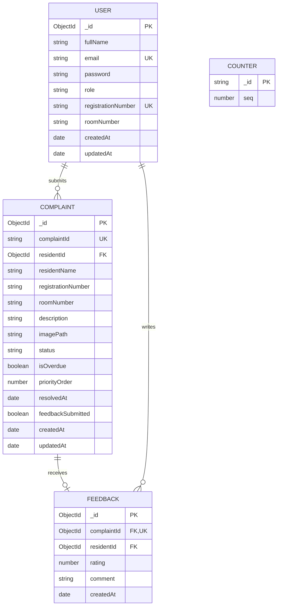

# Database Design
## Dormfix — Hostel Complaint & Maintenance Management System

**Group Number:** [Group Number]
**Database:** MongoDB (document-oriented, accessed via Mongoose)

---

## 1. Entity-Relationship Diagram

MongoDB is not relational, but the entities below have clear logical
relationships, shown here in ER form for clarity. Paste into a
Mermaid renderer to view/export.

## 2. Collection Descriptions

### 2.1 `users`
Stores both residents and the warden in a single collection,
distinguished by the `role` field. This avoids duplicate auth logic
for two nearly-identical entities.

| Field | Type | Constraints |
|-------|------|-------------|
| fullName | String | required |
| email | String | required, unique, lowercase |
| password | String | required, hashed (bcrypt), never returned in API responses |
| role | String | enum: `resident`, `warden` |
| registrationNumber | String | unique, sparse (only required for residents) |
| roomNumber | String | required for residents |

### 2.2 `complaints`
The core entity of the system.

| Field | Type | Constraints |
|-------|------|-------------|
| complaintId | String | unique, generated sequentially (HF-0001, HF-0002, ...) |
| residentId | ObjectId | references `users._id` |
| residentName, registrationNumber, roomNumber | String | denormalized copies taken from the resident's profile at submission time, so complaint records remain stable even if a profile changes later |
| description | String | required, 5–1000 characters |
| imagePath | String | nullable, path under `/uploads` |
| status | String | enum: `SUBMITTED`, `UNDER_PROGRESS`, `RESOLVED` |
| isOverdue | Boolean | server-calculated, not client-supplied |
| priorityOrder | Number | used for manual warden reordering |
| resolvedAt | Date | nullable, set when status becomes RESOLVED |
| feedbackSubmitted | Boolean | prevents duplicate feedback |

### 2.3 `feedbacks`
| Field | Type | Constraints |
|-------|------|-------------|
| complaintId | ObjectId | unique — enforces one feedback per complaint |
| residentId | ObjectId | references `users._id` |
| rating | Number | required, 1–5 |
| comment | String | optional, max 500 characters |

### 2.4 `counters`
A small internal helper collection (single document per counter name)
used to atomically generate sequential, human-readable complaint IDs
without race conditions under concurrent submissions.

## 3. Indexing Strategy

| Collection | Indexed Field(s) | Reason |
|------------|-------------------|--------|
| users | email | fast login lookup, uniqueness |
| users | registrationNumber | uniqueness check on registration |
| complaints | residentId | fast "my complaints" queries |
| complaints | status | fast filtering by status |
| complaints | createdAt | fast newest/oldest sorting |
| complaints | priorityOrder | fast manual-priority sorting |

## 4. Design Decisions and Trade-offs

- **Denormalization of resident details on the complaint document:**
  chosen so a complaint's historical record (who reported it, from
  which room) stays accurate even if the resident's profile is later
  edited — a deliberate trade-off of storage duplication for
  historical accuracy.
- **Single `users` collection for two roles:** simpler auth code at
  the cost of some fields being irrelevant for wardens (e.g.
  `roomNumber`); acceptable given the small role count.
- **`isOverdue` stored, not purely computed on read:** stored so it
  can be indexed and filtered efficiently, but always recalculated
  server-side before being trusted, so it can never go stale in a way
  that misleads the warden.
