# UML Diagrams: Complete Set

## DormFix: Hostel Complaint and Maintenance Management System

This file contains all seven UML diagram types for the DormFix project:
Use Case, Class, Object, Sequence, Collaboration, State and Activity.
Every diagram is written in Mermaid syntax and was derived from the current
source code under `server/` and `client/src/`.

To view a diagram, paste the Mermaid block into https://mermaid.live or open
this file in a Mermaid-enabled editor (GitHub, GitLab, VS Code with the
Mermaid extension, Obsidian). Export as PNG or SVG if the report needs
static images.

---

## Contents

1. [Use Case Diagram](#1-use-case-diagram)
2. [Class Diagram](#2-class-diagram)
3. [Object Diagram](#3-object-diagram)
4. [Sequence Diagrams](#4-sequence-diagrams)
5. [Collaboration Diagrams](#5-collaboration-diagrams)
6. [State Diagrams](#6-state-diagrams)
7. [Activity Diagrams](#7-activity-diagrams)
8. [Diagram-to-Source Mapping](#8-diagram-to-source-mapping)
9. [Implementation Gaps Found During Modelling](#9-implementation-gaps-found-during-modelling)

---

## 1. Use Case Diagram

Two actors interact with the DormFix system. The Resident is a self-registered
hostel student. The Warden is a seeded administrator account and cannot
self-register.

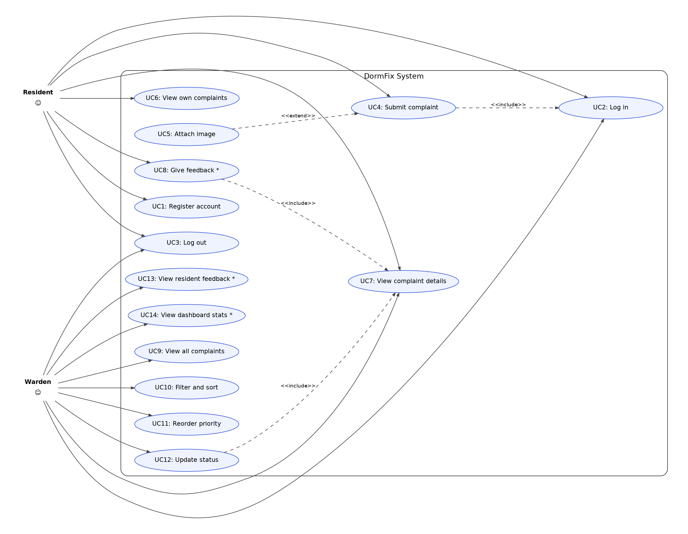

*Image rendered with Graphviz. Source: `diagrams/src/01_1_use_case_diagram.dot`. Items marked `*` are implemented in the code but their routes are currently disabled in `server.js` (see Section 9).*

**Use case descriptions (short form)**

| ID   | Use case                    | Actor(s)        | Backend endpoint                          | Status in code |
|------|-----------------------------|-----------------|-------------------------------------------|----------------|
| UC1  | Register account            | Resident        | `POST /api/auth/register`                 | Implemented    |
| UC2  | Log in                      | Resident, Warden| `POST /api/auth/login`                    | Implemented    |
| UC3  | Log out                     | Resident, Warden| (client only, clears localStorage)        | Implemented    |
| UC4  | Submit complaint            | Resident        | `POST /api/complaints`                    | Implemented    |
| UC5  | Attach image to complaint   | Resident        | `POST /api/complaints` (multipart field)  | Implemented    |
| UC6  | View own complaints         | Resident        | `GET /api/complaints/my`                  | Implemented    |
| UC7  | View complaint details      | Resident, Warden| `GET /api/complaints/:id`                 | Implemented    |
| UC8  | Give feedback after resolution | Resident     | `POST /api/complaints/:id/feedback`       | Route disabled (see Section 9) |
| UC9  | View all complaints         | Warden          | `GET /api/complaints`                     | Implemented    |
| UC10 | Filter and sort complaints  | Warden          | `GET /api/complaints?status&overdue&...`  | Implemented    |
| UC11 | Reorder priority up or down | Warden          | `PATCH /api/complaints/reorder`           | Implemented    |
| UC12 | Update complaint status     | Warden          | `PATCH /api/complaints/:id/status`        | Implemented    |
| UC13 | View resident feedback      | Warden          | `GET /api/complaints/:id/feedback`        | Route disabled (see Section 9) |
| UC14 | View warden dashboard stats | Warden          | `GET /api/dashboard/warden`               | Route disabled (see Section 9) |

---

## 2. Class Diagram

### 2.1 Domain Model (Persistent Entities)

This diagram shows the four Mongoose models in `server/models/`. Relationships
match the `ref` fields and the one-to-one or one-to-many rules enforced in
services.

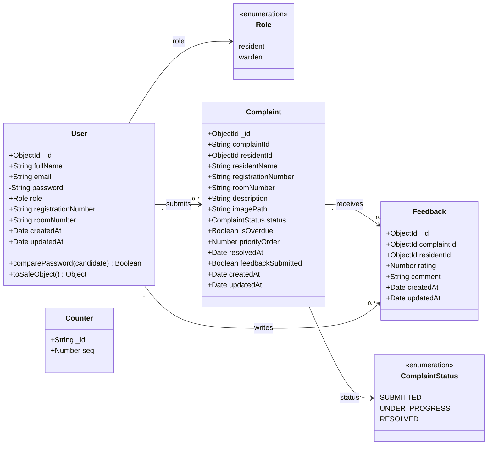
```mermaid
classDiagram
    direction LR

    class Role {
        <<enumeration>>
        resident
        warden
    }

    class ComplaintStatus {
        <<enumeration>>
        SUBMITTED
        UNDER_PROGRESS
        RESOLVED
    }

    class User {
        +ObjectId _id
        +String fullName
        +String email
        -String password
        +Role role
        +String registrationNumber
        +String roomNumber
        +Date createdAt
        +Date updatedAt
        +comparePassword(candidate) Boolean
        +toSafeObject() Object
    }

    class Complaint {
        +ObjectId _id
        +String complaintId
        +ObjectId residentId
        +String residentName
        +String registrationNumber
        +String roomNumber
        +String description
        +String imagePath
        +ComplaintStatus status
        +Boolean isOverdue
        +Number priorityOrder
        +Date resolvedAt
        +Boolean feedbackSubmitted
        +Date createdAt
        +Date updatedAt
    }

    class Feedback {
        +ObjectId _id
        +ObjectId complaintId
        +ObjectId residentId
        +Number rating
        +String comment
        +Date createdAt
        +Date updatedAt
    }

    class Counter {
        +String _id
        +Number seq
    }

    User "1" --> "0..*" Complaint : submits
    Complaint "1" --> "0..1" Feedback : receives
    User "1" --> "0..*" Feedback : writes
    Complaint --> ComplaintStatus : status
    User --> Role : role
```

**Model constraints worth noting in the report**

- `User.password` has `select: false`, so it is excluded from queries by default.
- `User.registrationNumber` is sparse and unique, so wardens have no value for it.
- `Complaint.complaintId` is unique and generated from `Counter` as `HF-0001`, `HF-0002`, and so on.
- `Feedback.complaintId` is unique, which enforces one feedback per complaint.
- `Feedback.rating` is restricted to the range 1 to 5.

### 2.2 Backend Layered Class Structure

This diagram shows the layered architecture: Routes call Middleware, then
Controllers, then Services, which in turn use Models and Utils.

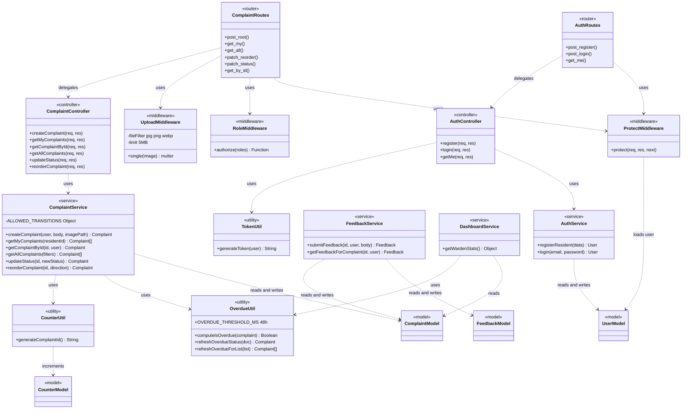
```mermaid
classDiagram
    direction TB

    class AuthRoutes {
        <<router>>
        +post_register()
        +post_login()
        +get_me()
    }

    class ComplaintRoutes {
        <<router>>
        +post_root()
        +get_my()
        +get_all()
        +patch_reorder()
        +patch_status()
        +get_by_id()
    }

    class ProtectMiddleware {
        <<middleware>>
        +protect(req, res, next)
    }

    class RoleMiddleware {
        <<middleware>>
        +authorize(roles) Function
    }

    class UploadMiddleware {
        <<middleware>>
        +single(image) multer
        -fileFilter jpg png webp
        -limit 5MB
    }

    class AuthController {
        <<controller>>
        +register(req, res)
        +login(req, res)
        +getMe(req, res)
    }

    class ComplaintController {
        <<controller>>
        +createComplaint(req, res)
        +getMyComplaints(req, res)
        +getComplaintById(req, res)
        +getAllComplaints(req, res)
        +updateStatus(req, res)
        +reorderComplaint(req, res)
    }

    class AuthService {
        <<service>>
        +registerResident(data) User
        +login(email, password) User
    }

    class ComplaintService {
        <<service>>
        -ALLOWED_TRANSITIONS Object
        +createComplaint(user, body, imagePath) Complaint
        +getMyComplaints(residentId) Complaint[]
        +getComplaintById(id, user) Complaint
        +getAllComplaints(filters) Complaint[]
        +updateStatus(id, newStatus) Complaint
        +reorderComplaint(id, direction) Complaint
    }

    class FeedbackService {
        <<service>>
        +submitFeedback(id, user, body) Feedback
        +getFeedbackForComplaint(id, user) Feedback
    }

    class DashboardService {
        <<service>>
        +getWardenStats() Object
    }

    class OverdueUtil {
        <<utility>>
        +OVERDUE_THRESHOLD_MS 48h
        +computeIsOverdue(complaint) Boolean
        +refreshOverdueStatus(doc) Complaint
        +refreshOverdueForList(list) Complaint[]
    }

    class CounterUtil {
        <<utility>>
        +generateComplaintId() String
    }

    class TokenUtil {
        <<utility>>
        +generateToken(user) String
    }

    class UserModel {
        <<model>>
    }

    class ComplaintModel {
        <<model>>
    }

    class FeedbackModel {
        <<model>>
    }

    class CounterModel {
        <<model>>
    }

    AuthRoutes ..> ProtectMiddleware : uses
    ComplaintRoutes ..> ProtectMiddleware : uses
    ComplaintRoutes ..> RoleMiddleware : uses
    ComplaintRoutes ..> UploadMiddleware : uses

    AuthRoutes ..> AuthController : delegates
    ComplaintRoutes ..> ComplaintController : delegates

    AuthController ..> AuthService : uses
    AuthController ..> TokenUtil : uses
    ComplaintController ..> ComplaintService : uses

    AuthService ..> UserModel : reads and writes
    ComplaintService ..> ComplaintModel : reads and writes
    ComplaintService ..> OverdueUtil : uses
    ComplaintService ..> CounterUtil : uses
    FeedbackService ..> FeedbackModel : reads and writes
    FeedbackService ..> ComplaintModel : reads and writes
    DashboardService ..> ComplaintModel : reads
    DashboardService ..> OverdueUtil : uses
    CounterUtil ..> CounterModel : increments
    ProtectMiddleware ..> UserModel : loads user
```

**Design notes**

- Controllers contain no business logic. They only read `req`, call a service, and format the response with `success()` or `error()`.
- Services throw an `AppError` with an HTTP status code. The global `errorHandler` converts it into the response.
- `ComplaintService` checks ownership for residents itself, because the route has no per-object check.

---

## 3. Object Diagram

This is a runtime snapshot of the database after a sequence of actions:
two residents exist, one complaint is in progress and another is resolved
with feedback. Values are illustrative and based on the seed data in
`server/seed/seed.js`. The complaint `HF-0002` is the case in which the
resident has submitted feedback.

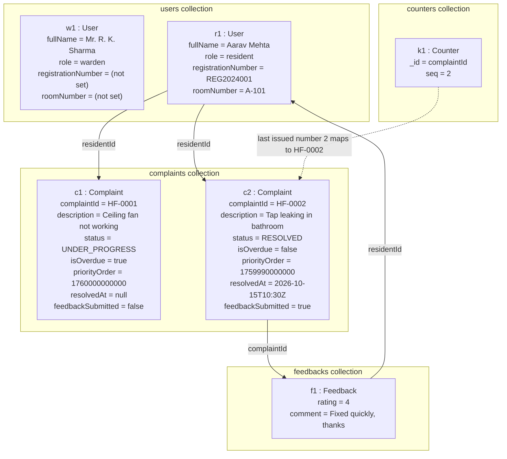
```mermaid
flowchart TB
    subgraph UsersCollection ["users collection"]
        w1["w1 : User<br/>fullName = Mr. R. K. Sharma<br/>role = warden<br/>registrationNumber = (not set)<br/>roomNumber = (not set)"]
        r1["r1 : User<br/>fullName = Aarav Mehta<br/>role = resident<br/>registrationNumber = REG2024001<br/>roomNumber = A-101"]
    end

    subgraph ComplaintsCollection ["complaints collection"]
        c1["c1 : Complaint<br/>complaintId = HF-0001<br/>description = Ceiling fan not working<br/>status = UNDER_PROGRESS<br/>isOverdue = true<br/>priorityOrder = 1760000000000<br/>resolvedAt = null<br/>feedbackSubmitted = false"]
        c2["c2 : Complaint<br/>complaintId = HF-0002<br/>description = Tap leaking in bathroom<br/>status = RESOLVED<br/>isOverdue = false<br/>priorityOrder = 1759990000000<br/>resolvedAt = 2026-10-15T10:30Z<br/>feedbackSubmitted = true"]
    end

    subgraph FeedbackCollection ["feedbacks collection"]
        f1["f1 : Feedback<br/>rating = 4<br/>comment = Fixed quickly, thanks"]
    end

    subgraph CountersCollection ["counters collection"]
        k1["k1 : Counter<br/>_id = complaintId<br/>seq = 2"]
    end

    r1 -->|residentId| c1
    r1 -->|residentId| c2
    c2 -->|complaintId| f1
    f1 -->|residentId| r1
    k1 -.->|last issued number 2 maps to HF-0002| c2
```

**Reading the snapshot:** `c1` is flagged `isOverdue = true` because its
`createdAt` is more than 48 hours old and it is not yet resolved. `c2` is
not overdue because it is resolved. `k1.seq = 2` means the next complaint will
receive the ID `HF-0003`.

---

## 4. Sequence Diagrams

### 4.1 Resident Login

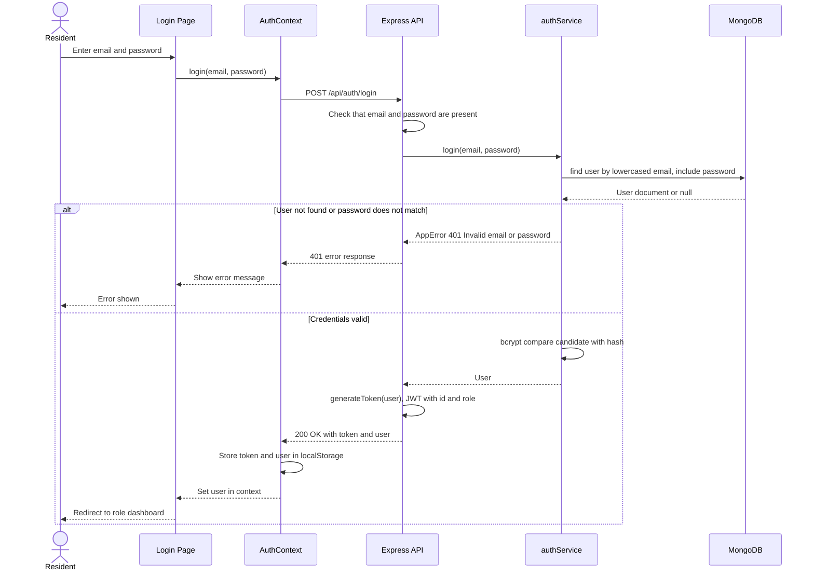
```mermaid
sequenceDiagram
    actor Resident
    participant UI as Login Page
    participant Ctx as AuthContext
    participant API as Express API
    participant AS as authService
    participant DB as MongoDB

    Resident->>UI: Enter email and password
    UI->>Ctx: login(email, password)
    Ctx->>API: POST /api/auth/login
    API->>API: Check that email and password are present
    API->>AS: login(email, password)
    AS->>DB: find user by lowercased email, include password
    DB-->>AS: User document or null

    alt User not found or password does not match
        AS-->>API: AppError 401 Invalid email or password
        API-->>Ctx: 401 error response
        Ctx-->>UI: Show error message
        UI-->>Resident: Error shown
    else Credentials valid
        AS->>AS: bcrypt compare candidate with hash
        AS-->>API: User
        API->>API: generateToken(user), JWT with id and role
        API-->>Ctx: 200 OK with token and user
        Ctx->>Ctx: Store token and user in localStorage
        Ctx-->>UI: Set user in context
        UI-->>Resident: Redirect to role dashboard
    end
```

### 4.2 Resident Submits Complaint

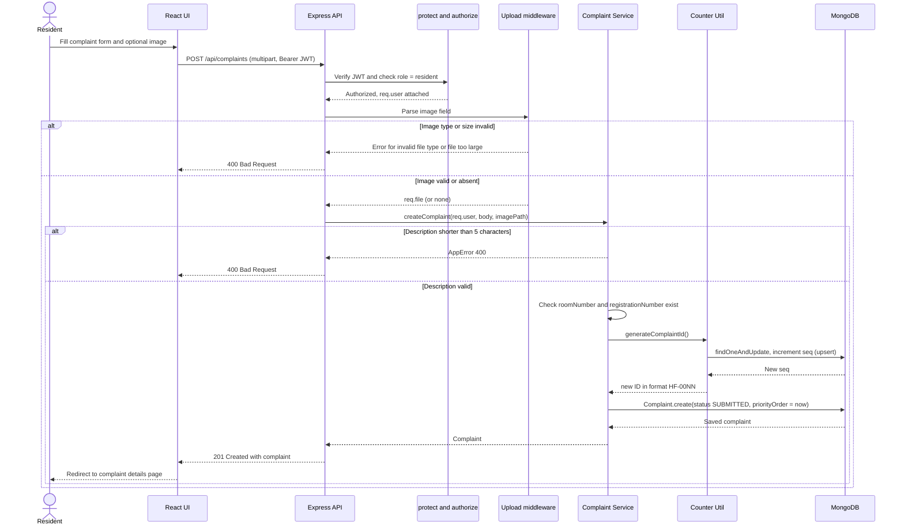
```mermaid
sequenceDiagram
    actor Resident
    participant UI as React UI
    participant API as Express API
    participant MW as protect and authorize
    participant UP as Upload middleware
    participant SVC as Complaint Service
    participant CNT as Counter Util
    participant DB as MongoDB

    Resident->>UI: Fill complaint form and optional image
    UI->>API: POST /api/complaints (multipart, Bearer JWT)
    API->>MW: Verify JWT and check role = resident
    MW-->>API: Authorized, req.user attached
    API->>UP: Parse image field
    alt Image type or size invalid
        UP-->>API: Error for invalid file type or file too large
        API-->>UI: 400 Bad Request
    else Image valid or absent
        UP-->>API: req.file (or none)
        API->>SVC: createComplaint(req.user, body, imagePath)
        alt Description shorter than 5 characters
            SVC-->>API: AppError 400
            API-->>UI: 400 Bad Request
        else Description valid
            SVC->>SVC: Check roomNumber and registrationNumber exist
            SVC->>CNT: generateComplaintId()
            CNT->>DB: findOneAndUpdate, increment seq (upsert)
            DB-->>CNT: New seq
            CNT-->>SVC: new ID in format HF-00NN
            SVC->>DB: Complaint.create(status SUBMITTED, priorityOrder = now)
            DB-->>SVC: Saved complaint
            SVC-->>API: Complaint
            API-->>UI: 201 Created with complaint
            UI-->>Resident: Redirect to complaint details page
        end
    end
```

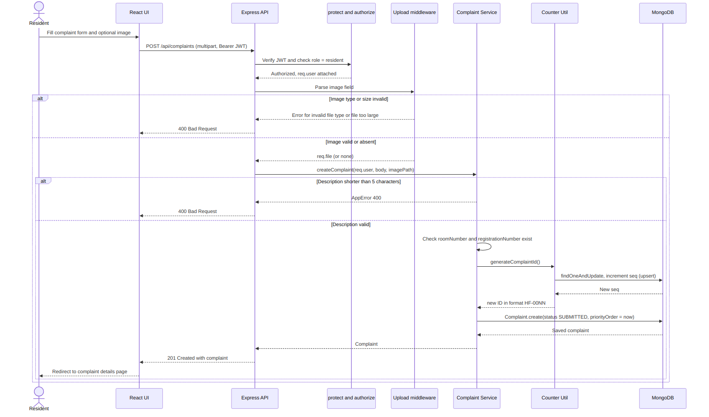

### 4.3 Warden Updates Complaint Status

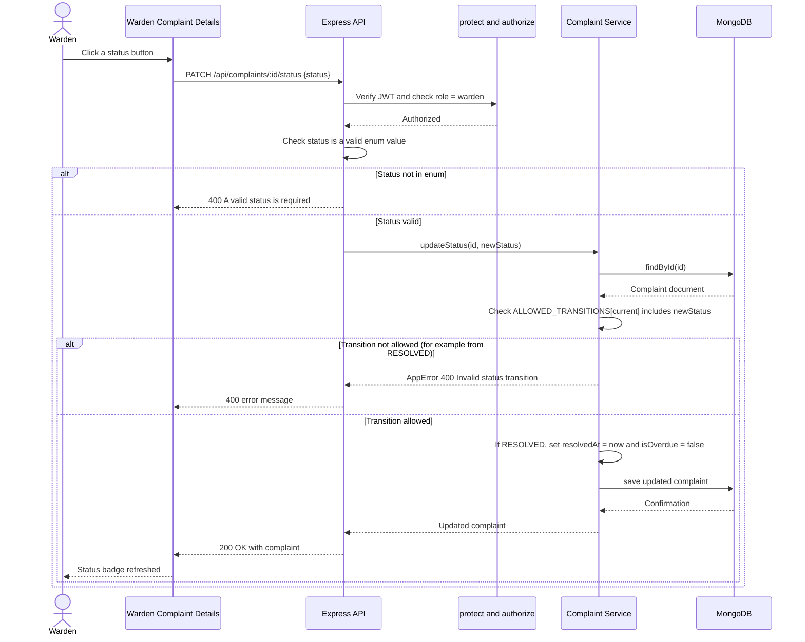
```mermaid
sequenceDiagram
    actor Warden
    participant UI as Warden Complaint Details
    participant API as Express API
    participant MW as protect and authorize
    participant SVC as Complaint Service
    participant DB as MongoDB

    Warden->>UI: Click a status button
    UI->>API: PATCH /api/complaints/:id/status {status}
    API->>MW: Verify JWT and check role = warden
    MW-->>API: Authorized
    API->>API: Check status is a valid enum value
    alt Status not in enum
        API-->>UI: 400 A valid status is required
    else Status valid
        API->>SVC: updateStatus(id, newStatus)
        SVC->>DB: findById(id)
        DB-->>SVC: Complaint document
        SVC->>SVC: Check ALLOWED_TRANSITIONS[current] includes newStatus

        alt Transition not allowed (for example from RESOLVED)
            SVC-->>API: AppError 400 Invalid status transition
            API-->>UI: 400 error message
        else Transition allowed
            SVC->>SVC: If RESOLVED, set resolvedAt = now and isOverdue = false
            SVC->>DB: save updated complaint
            DB-->>SVC: Confirmation
            SVC-->>API: Updated complaint
            API-->>UI: 200 OK with complaint
            UI-->>Warden: Status badge refreshed
        end
    end
```

### 4.4 Warden Reorders Complaint Priority

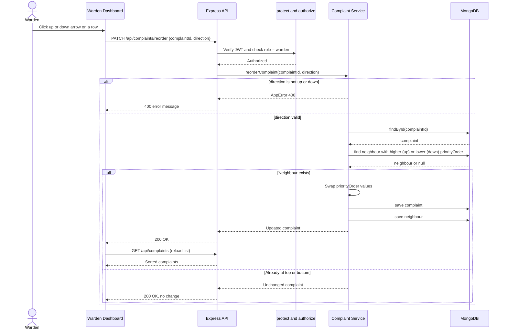
```mermaid
sequenceDiagram
    actor Warden
    participant UI as Warden Dashboard
    participant API as Express API
    participant MW as protect and authorize
    participant SVC as Complaint Service
    participant DB as MongoDB

    Warden->>UI: Click up or down arrow on a row
    UI->>API: PATCH /api/complaints/reorder {complaintId, direction}
    API->>MW: Verify JWT and check role = warden
    MW-->>API: Authorized
    API->>SVC: reorderComplaint(complaintId, direction)

    alt direction is not up or down
        SVC-->>API: AppError 400
        API-->>UI: 400 error message
    else direction valid
        SVC->>DB: findById(complaintId)
        DB-->>SVC: complaint
        SVC->>DB: find neighbour with higher (up) or lower (down) priorityOrder
        DB-->>SVC: neighbour or null

        alt Neighbour exists
            SVC->>SVC: Swap priorityOrder values
            SVC->>DB: save complaint
            SVC->>DB: save neighbour
            SVC-->>API: Updated complaint
            API-->>UI: 200 OK
            UI->>API: GET /api/complaints (reload list)
            API-->>UI: Sorted complaints
        else Already at top or bottom
            SVC-->>API: Unchanged complaint
            API-->>UI: 200 OK, no change
        end
    end
```

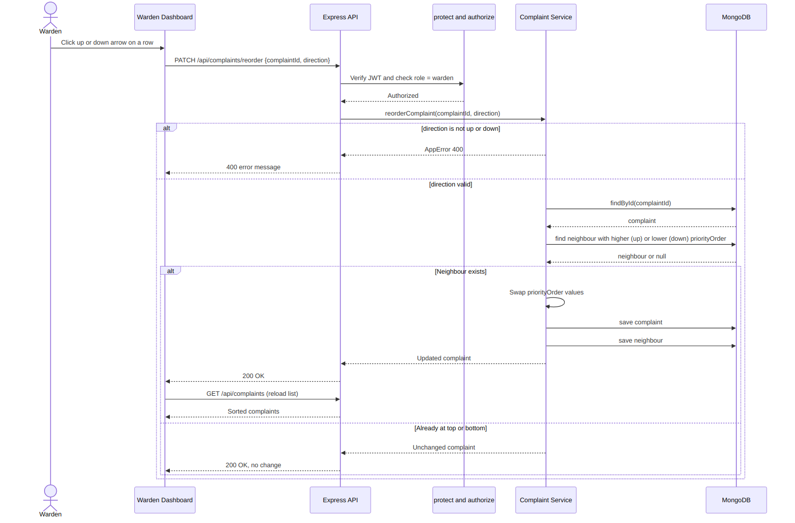

### 4.5 Resident Views Own Complaints (Overdue Refresh)

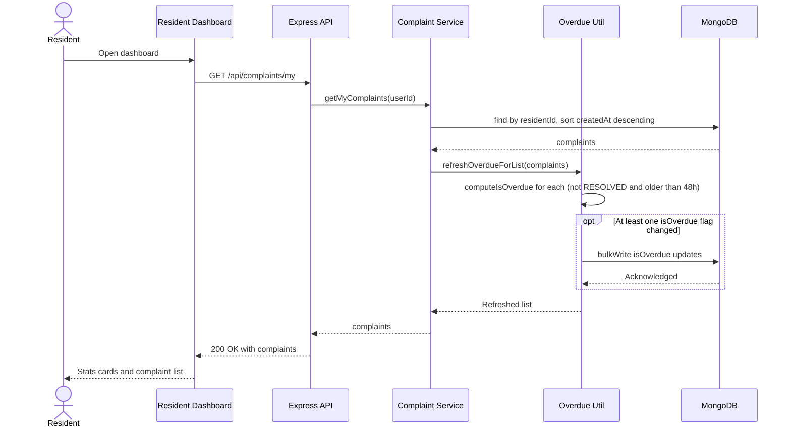
```mermaid
sequenceDiagram
    actor Resident
    participant UI as Resident Dashboard
    participant API as Express API
    participant SVC as Complaint Service
    participant OD as Overdue Util
    participant DB as MongoDB

    Resident->>UI: Open dashboard
    UI->>API: GET /api/complaints/my
    API->>SVC: getMyComplaints(userId)
    SVC->>DB: find by residentId, sort createdAt descending
    DB-->>SVC: complaints
    SVC->>OD: refreshOverdueForList(complaints)
    OD->>OD: computeIsOverdue for each (not RESOLVED and older than 48h)

    opt At least one isOverdue flag changed
        OD->>DB: bulkWrite isOverdue updates
        DB-->>OD: Acknowledged
    end

    OD-->>SVC: Refreshed list
    SVC-->>API: complaints
    API-->>UI: 200 OK with complaints
    UI-->>Resident: Stats cards and complaint list
```

### 4.6 Resident Submits Feedback (Designed Flow)

> This flow is implemented in `feedbackController.js` and `feedbackService.js`,
> and the client calls it from `ComplaintDetails.jsx`. However, the route is
> currently commented out in `server/server.js`, so in the current build this
> request receives a 404. The diagram shows the intended behaviour.

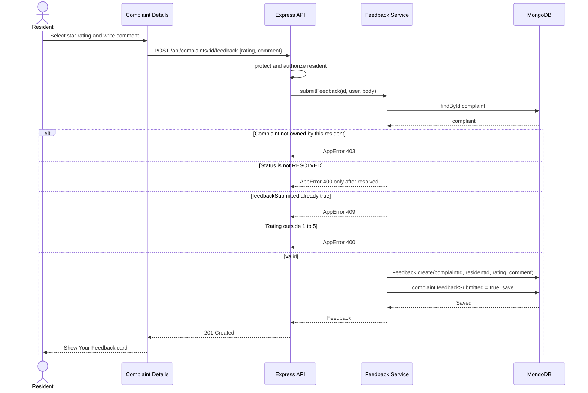
```mermaid
sequenceDiagram
    actor Resident
    participant UI as Complaint Details
    participant API as Express API
    participant SVC as Feedback Service
    participant DB as MongoDB

    Resident->>UI: Select star rating and write comment
    UI->>API: POST /api/complaints/:id/feedback {rating, comment}
    API->>API: protect and authorize resident
    API->>SVC: submitFeedback(id, user, body)
    SVC->>DB: findById complaint
    DB-->>SVC: complaint

    alt Complaint not owned by this resident
        SVC-->>API: AppError 403
    else Status is not RESOLVED
        SVC-->>API: AppError 400 only after resolved
    else feedbackSubmitted already true
        SVC-->>API: AppError 409
    else Rating outside 1 to 5
        SVC-->>API: AppError 400
    else Valid
        SVC->>DB: Feedback.create(complaintId, residentId, rating, comment)
        SVC->>DB: complaint.feedbackSubmitted = true, save
        DB-->>SVC: Saved
        SVC-->>API: Feedback
        API-->>UI: 201 Created
        UI-->>Resident: Show Your Feedback card
    end
```

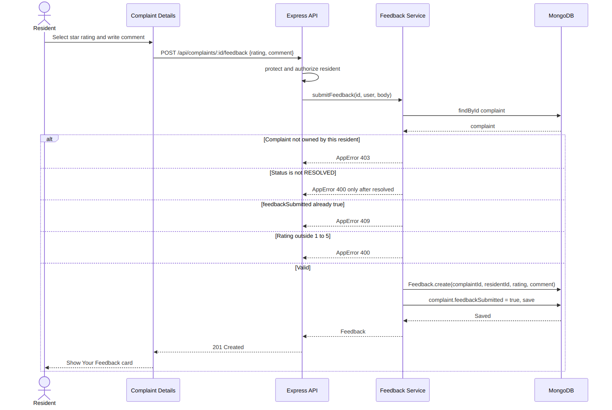

---

## 5. Collaboration Diagrams

Collaboration diagrams show the same interactions as sequence diagrams, but
emphasise the structural links between objects. Messages are numbered in
their order of execution.

### 5.1 Collaboration: Submit Complaint

```mermaid
flowchart LR
    R(["Resident"])
    UI[":NewComplaint page"]
    AX[":complaintApi"]
    RT[":complaintRoutes"]
    MW[":protect and authorize"]
    UP[":upload middleware"]
    CC[":complaintController"]
    CS[":complaintService"]
    CN[":Counter model"]
    CM[":Complaint model"]
    DB[("MongoDB")]

    R -->|"1: fill form and submit"| UI
    UI -->|"2: createComplaint(formData)"| AX
    AX -->|"3: POST /api/complaints"| RT
    RT -->|"4: verify JWT and role"| MW
    MW -->|"5: authorized"| RT
    RT -->|"6: parse image"| UP
    UP -->|"7: req.file"| CC
    CC -->|"8: createComplaint(user, body, imagePath)"| CS
    CS -->|"9: findOneAndUpdate seq"| CN
    CN -->|"10: HF-00NN"| CS
    CS -->|"11: create(complaint)"| CM
    CM -->|"12: insert"| DB
    DB -->|"13: saved document"| CM
    CM -->|"14: complaint"| CS
    CS -->|"15: complaint"| CC
    CC -->|"16: 201 Created"| AX
    AX -->|"17: data"| UI
```

### 5.2 Collaboration: Warden Updates Status

```mermaid
flowchart LR
    W(["Warden"])
    UI[":WardenComplaintDetails page"]
    AX[":complaintApi"]
    RT[":complaintRoutes"]
    MW[":protect and authorize"]
    CC[":complaintController"]
    CS[":complaintService"]
    CM[":Complaint model"]
    DB[("MongoDB")]

    W -->|"1: click status button"| UI
    UI -->|"2: updateComplaintStatus(id, status)"| AX
    AX -->|"3: PATCH /api/complaints/:id/status"| RT
    RT -->|"4: verify JWT and role warden"| MW
    MW -->|"5: authorized"| RT
    RT -->|"6: updateStatus(req)"| CC
    CC -->|"7: updateStatus(id, status)"| CS
    CS -->|"8: findById(id)"| CM
    CM -->|"9: query"| DB
    DB -->|"10: document"| CM
    CM -->|"11: complaint"| CS
    CS -->|"12: save with new status"| CM
    CM -->|"13: update"| DB
    CS -->|"14: updated complaint"| CC
    CC -->|"15: 200 OK"| AX
    AX -->|"16: refresh UI"| UI
```

---

## 6. State Diagrams

### 6.1 Complaint Lifecycle (status field)

The `status` field of `Complaint` moves only through the transitions defined
in `ALLOWED_TRANSITIONS` in `complaintService.js`. `RESOLVED` is terminal.

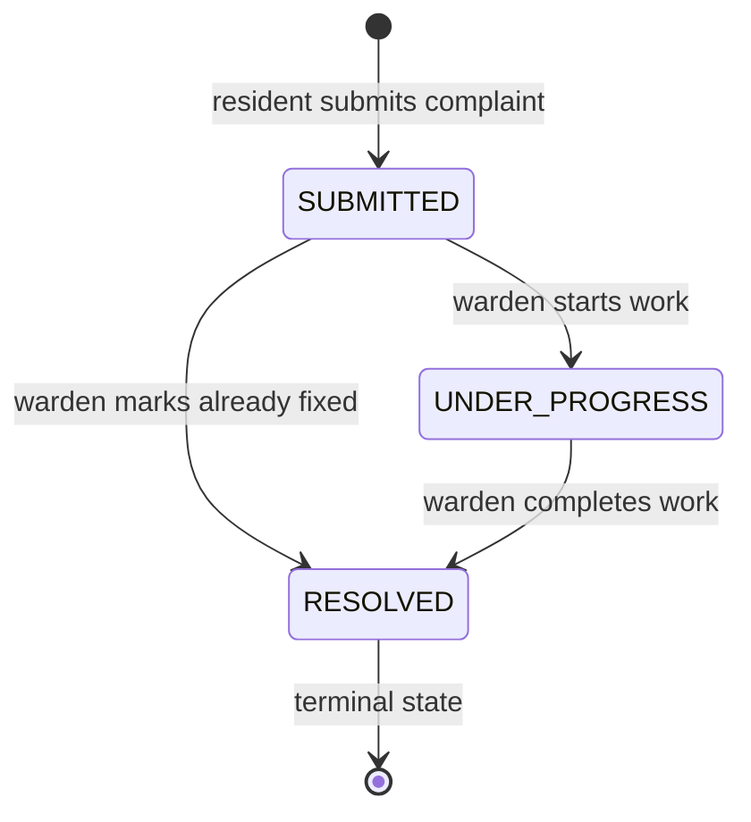
```mermaid
stateDiagram-v2
    [*] --> SUBMITTED : resident submits complaint

    SUBMITTED --> UNDER_PROGRESS : warden starts work
    SUBMITTED --> RESOLVED : warden marks already fixed
    UNDER_PROGRESS --> RESOLVED : warden completes work

    RESOLVED --> [*] : terminal state
```

### 6.2 Overdue Flag (isOverdue, derived)

`isOverdue` is not stored as a user input. It is recalculated by the server
every time a complaint is read, using `computeIsOverdue()` in `overdue.js`.

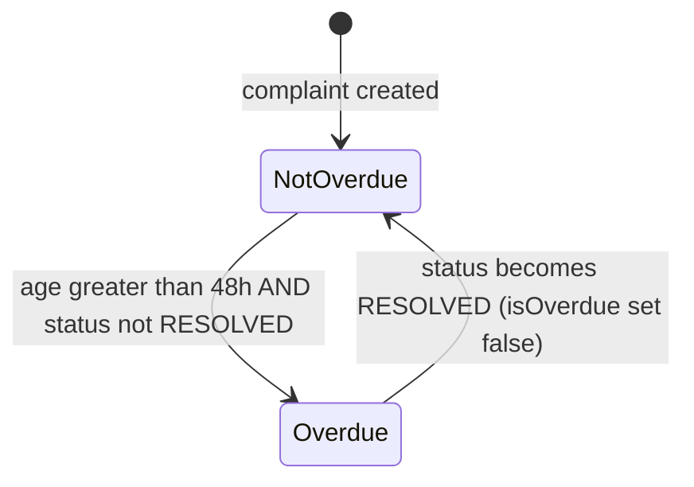
```mermaid
stateDiagram-v2
    [*] --> NotOverdue : complaint created

    NotOverdue --> Overdue : age greater than 48h AND status not RESOLVED
    Overdue --> NotOverdue : status becomes RESOLVED (isOverdue set false)

```

### 6.3 Client Session (Browser State)

This describes the React application's authentication state, managed by
`AuthContext.jsx`.

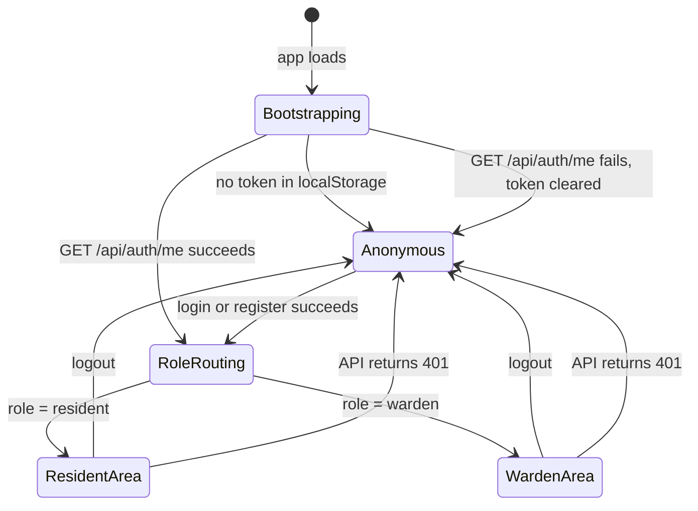
```mermaid
stateDiagram-v2
    [*] --> Bootstrapping : app loads

    Bootstrapping --> Anonymous : no token in localStorage
    Bootstrapping --> RoleRouting : GET /api/auth/me succeeds
    Bootstrapping --> Anonymous : GET /api/auth/me fails, token cleared

    Anonymous --> RoleRouting : login or register succeeds

    RoleRouting --> ResidentArea : role = resident
    RoleRouting --> WardenArea : role = warden

    ResidentArea --> Anonymous : logout
    WardenArea --> Anonymous : logout
    ResidentArea --> Anonymous : API returns 401
    WardenArea --> Anonymous : API returns 401
```

---

## 7. Activity Diagrams

Activity diagrams use `flowchart`. Swimlanes are approximated with subgraphs,
one per actor or system component.

### 7.1 Activity: Resident Submits Complaint

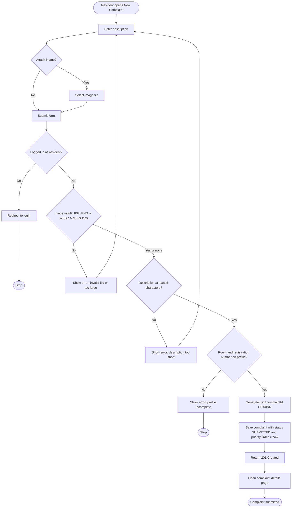
```mermaid
flowchart TD
    Start([Resident opens New Complaint]) --> Fill[Enter description]
    Fill --> Attach{Attach image?}
    Attach -->|Yes| Pick[Select image file]
    Attach -->|No| Submit
    Pick --> Submit[Submit form]

    Submit --> CheckAuth{Logged in as resident?}
    CheckAuth -->|No| Login[Redirect to login] --> Finish1([Stop])
    CheckAuth -->|Yes| CheckImg{Image valid? JPG, PNG or WEBP, 5 MB or less}
    CheckImg -->|No| ErrImg[Show error: invalid file or too large] --> Fill
    CheckImg -->|Yes or none| CheckDesc{Description at least 5 characters?}

    CheckDesc -->|No| ErrDesc[Show error: description too short] --> Fill
    CheckDesc -->|Yes| CheckProfile{Room and registration number on profile?}

    CheckProfile -->|No| ErrProfile[Show error: profile incomplete] --> Finish2([Stop])
    CheckProfile -->|Yes| GenId[Generate next complaintId HF-00NN]
    GenId --> Save[Save complaint with status SUBMITTED and priorityOrder = now]
    Save --> Created[Return 201 Created]
    Created --> Details[Open complaint details page]
    Details --> Finish3([Complaint submitted])
```

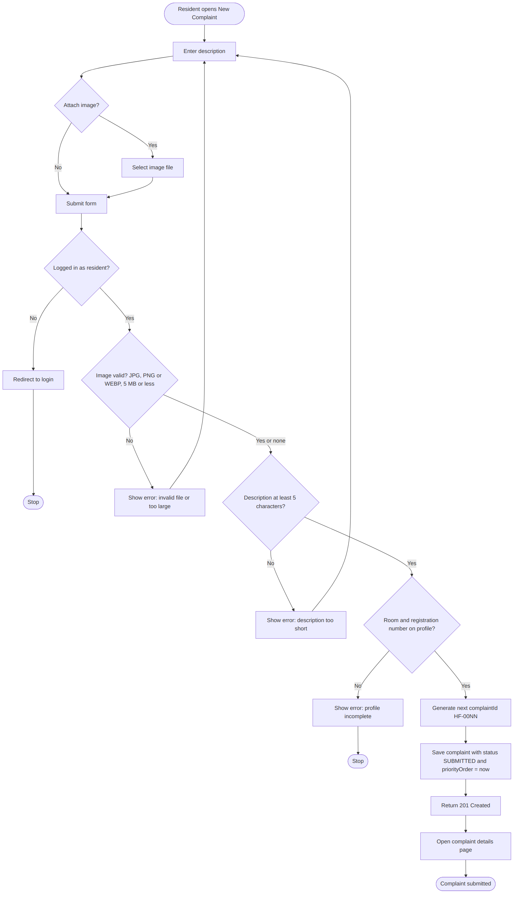

### 7.2 Activity: Warden Complaint Management

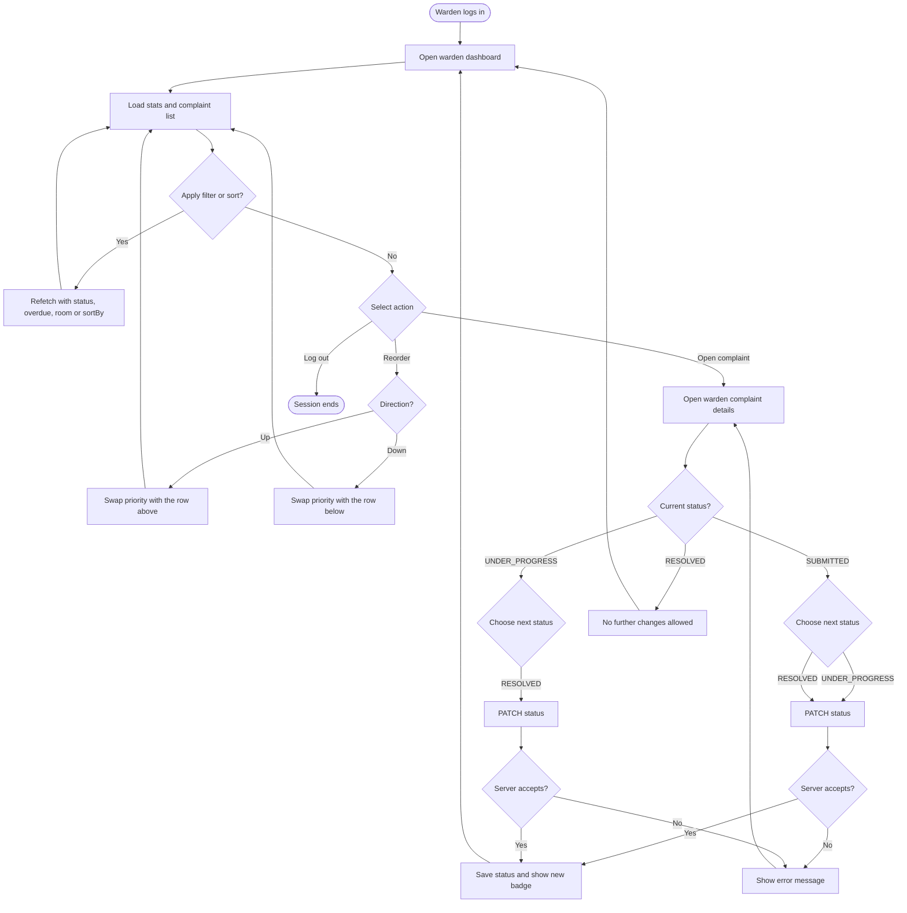
```mermaid
flowchart TD
    Start([Warden logs in]) --> Dash[Open warden dashboard]
    Dash --> Load[Load stats and complaint list]
    Load --> Filter{Apply filter or sort?}
    Filter -->|Yes| Apply[Refetch with status, overdue, room or sortBy] --> Load
    Filter -->|No| Choose{Select action}

    Choose -->|Reorder| Dir{Direction?}
    Dir -->|Up| Up[Swap priority with the row above] --> Load
    Dir -->|Down| Down[Swap priority with the row below] --> Load

    Choose -->|Open complaint| Details[Open warden complaint details]
    Details --> Next{Current status?}
    Next -->|SUBMITTED| Opt1{Choose next status}
    Next -->|UNDER_PROGRESS| Opt2{Choose next status}
    Next -->|RESOLVED| Locked[No further changes allowed] --> Dash

    Opt1 -->|UNDER_PROGRESS| Upd1[PATCH status] --> Check1{Server accepts?}
    Opt1 -->|RESOLVED| Upd1
    Opt2 -->|RESOLVED| Upd2[PATCH status] --> Check2{Server accepts?}

    Check1 -->|Yes| Saved[Save status and show new badge] --> Dash
    Check1 -->|No| Err1[Show error message] --> Details
    Check2 -->|Yes| Saved
    Check2 -->|No| Err1

    Choose -->|Log out| Finish4([Session ends])
```

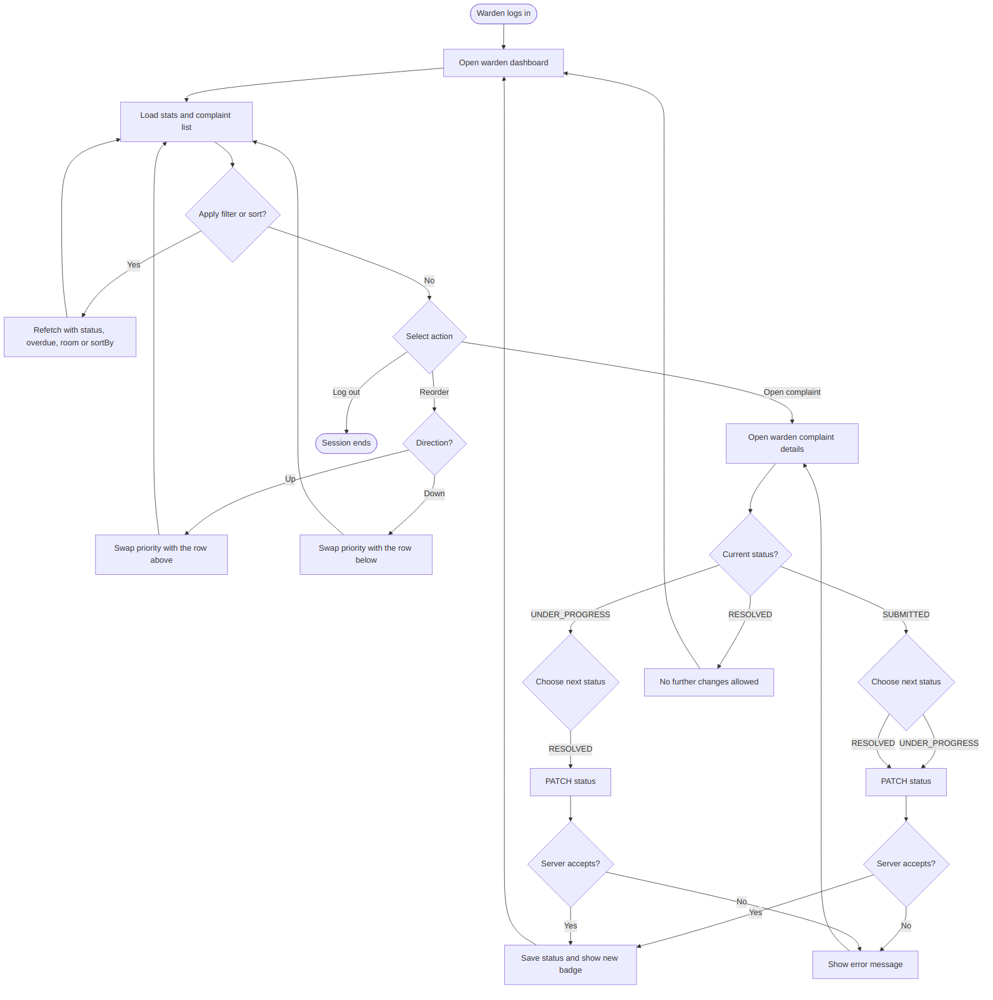

### 7.3 Activity: Complaint Overdue Evaluation

Runs on every complaint read, whether by resident list, warden list or a
single detail request.

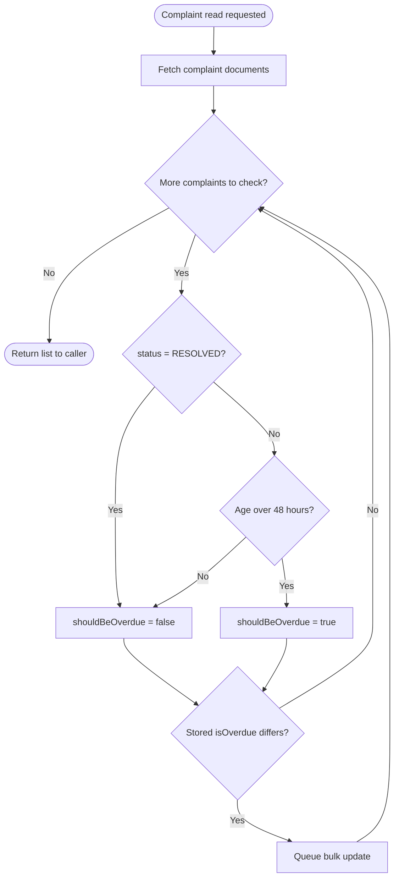
```mermaid
flowchart TD
    Start([Complaint read requested]) --> Fetch[Fetch complaint documents]
    Fetch --> Loop{More complaints to check?}
    Loop -->|No| Return([Return list to caller])
    Loop -->|Yes| Status{status = RESOLVED?}

    Status -->|Yes| Want0[shouldBeOverdue = false]
    Status -->|No| Age{Age over 48 hours?}
    Age -->|Yes| Want1[shouldBeOverdue = true]
    Age -->|No| Want0

    Want0 --> Diff{Stored isOverdue differs?}
    Want1 --> Diff
    Diff -->|No| Loop
    Diff -->|Yes| Queue[Queue bulk update] --> Loop
```

### 7.4 Activity: Authentication and Role Routing

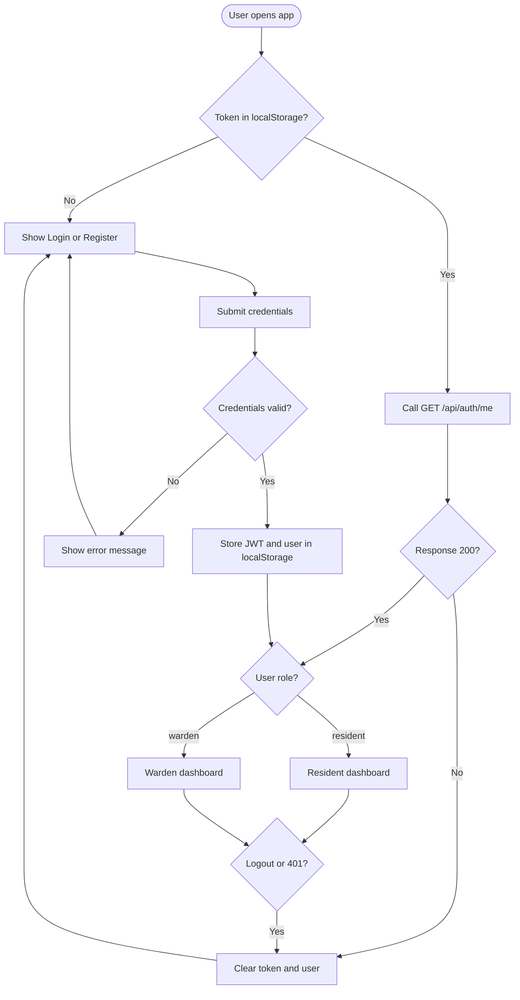
```mermaid
flowchart TD
    Start([User opens app]) --> Token{Token in localStorage?}
    Token -->|No| Login[Show Login or Register]
    Token -->|Yes| Me[Call GET /api/auth/me]

    Me --> Valid{Response 200?}
    Valid -->|No| Clear[Clear token and user] --> Login
    Valid -->|Yes| Role{User role?}

    Role -->|resident| RDash[Resident dashboard]
    Role -->|warden| WDash[Warden dashboard]

    Login --> Submit[Submit credentials]
    Submit --> Check{Credentials valid?}
    Check -->|No| Err[Show error message] --> Login
    Check -->|Yes| Issue[Store JWT and user in localStorage]
    Issue --> Role

    RDash --> Logout{Logout or 401?}
    WDash --> Logout
    Logout -->|Yes| Clear
```

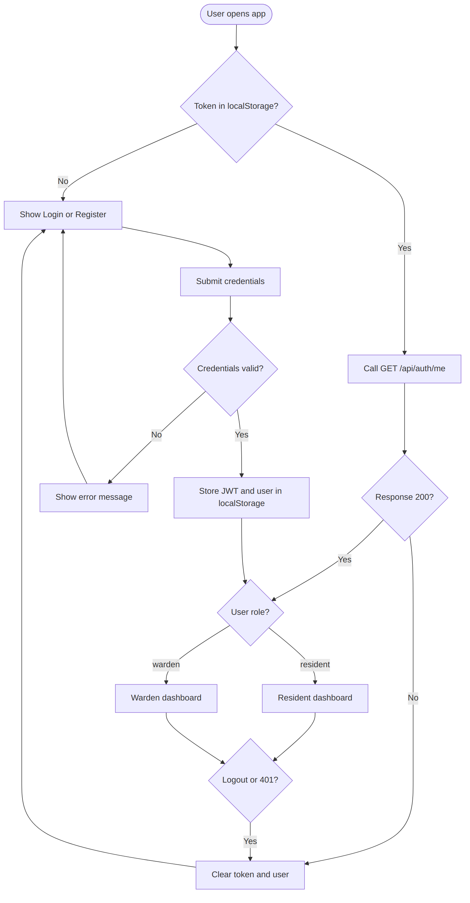

---

## 8. Diagram-to-Source Mapping

| Diagram                  | Primary source files |
|--------------------------|----------------------|
| Use Case                 | `server/routes/*.js`, `client/src/App.jsx`, `Report/02_Requirements/Use_Cases_and_User_Stories.md` |
| Class (domain)           | `server/models/User.js`, `Complaint.js`, `Feedback.js`, `Counter.js` |
| Class (layered)          | `server/routes`, `controllers`, `services`, `middleware`, `utils` |
| Object                   | Schema definitions in `server/models`, seed data in `server/seed/seed.js` |
| Sequence: Login          | `client/src/context/AuthContext.jsx`, `server/controllers/authController.js`, `server/services/authService.js` |
| Sequence: Submit         | `client/src/pages/NewComplaint.jsx`, `server/middleware/upload.js`, `server/services/complaintService.js` |
| Sequence: Status update  | `client/src/pages/WardenComplaintDetails.jsx`, `server/services/complaintService.js` (`ALLOWED_TRANSITIONS`) |
| Sequence: Reorder        | `client/src/pages/WardenDashboard.jsx`, `server/services/complaintService.js` (`reorderComplaint`) |
| Sequence: View own       | `client/src/pages/ResidentDashboard.jsx`, `server/utils/overdue.js` |
| Sequence: Feedback       | `server/services/feedbackService.js`, `client/src/pages/ComplaintDetails.jsx` |
| Collaboration            | Same files as the matching sequence diagrams |
| State: Complaint         | `server/services/complaintService.js`, `server/models/Complaint.js` |
| State: Overdue           | `server/utils/overdue.js` |
| State: Client session    | `client/src/context/AuthContext.jsx`, `client/src/api/axios.js` |
| Activity: Submit         | `client/src/pages/NewComplaint.jsx`, `server/services/complaintService.js` |
| Activity: Warden         | `client/src/pages/WardenDashboard.jsx`, `WardenComplaintDetails.jsx` |
| Activity: Overdue        | `server/utils/overdue.js` |
| Activity: Auth           | `client/src/context/AuthContext.jsx`, `client/src/components/ProtectedRoute.jsx` |

---

