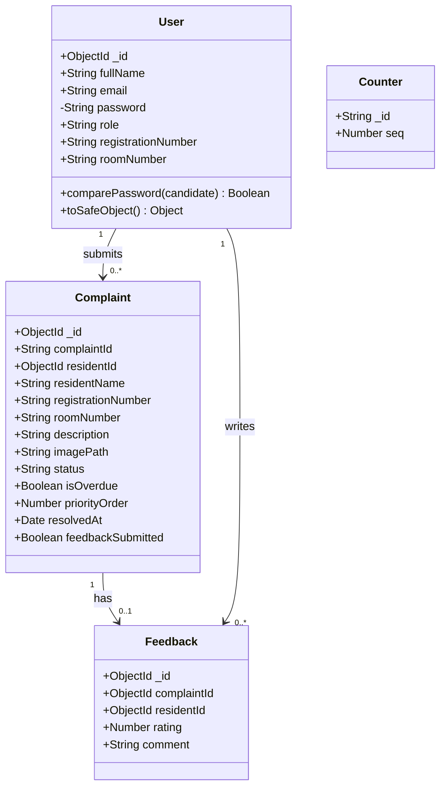
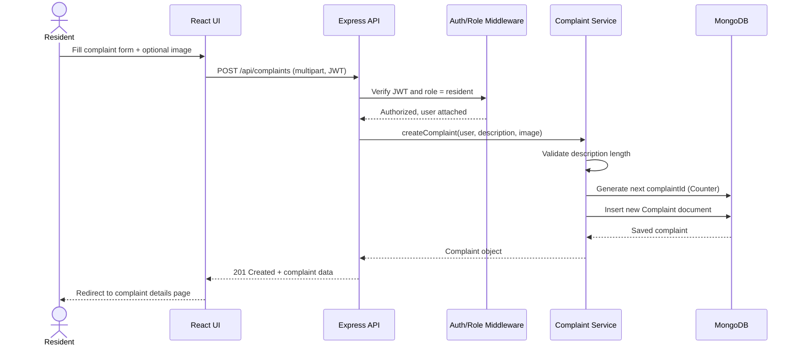
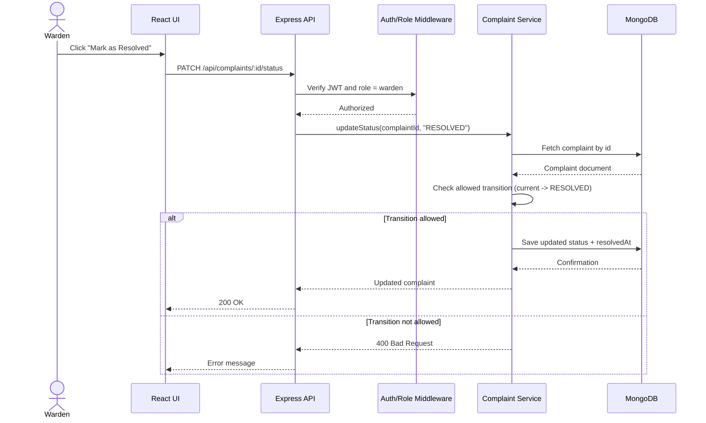
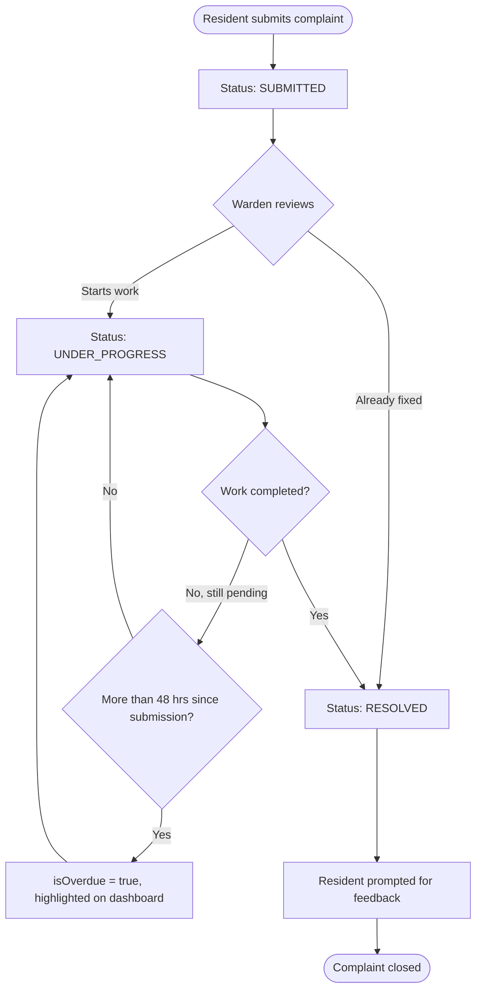
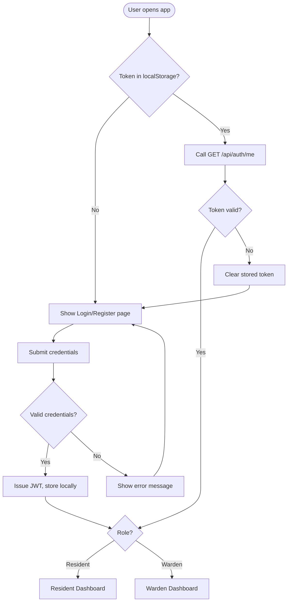

# UML Diagrams
## HostelFix — Hostel Complaint & Maintenance Management System

**Group Number:** [Group Number]

All diagrams below are written in Mermaid syntax. Paste any block into
mermaid.live (or a Mermaid-enabled editor) to render and export as an
image for the report if your submission requires static images.

---

## 1. Class Diagram (Backend Domain Model)

## 2. Sequence Diagram — Submit Complaint

## 3. Sequence Diagram — Warden Updates Status

## 4. Activity Diagram — Complaint Lifecycle

## 5. Activity Diagram — Authentication Flow

